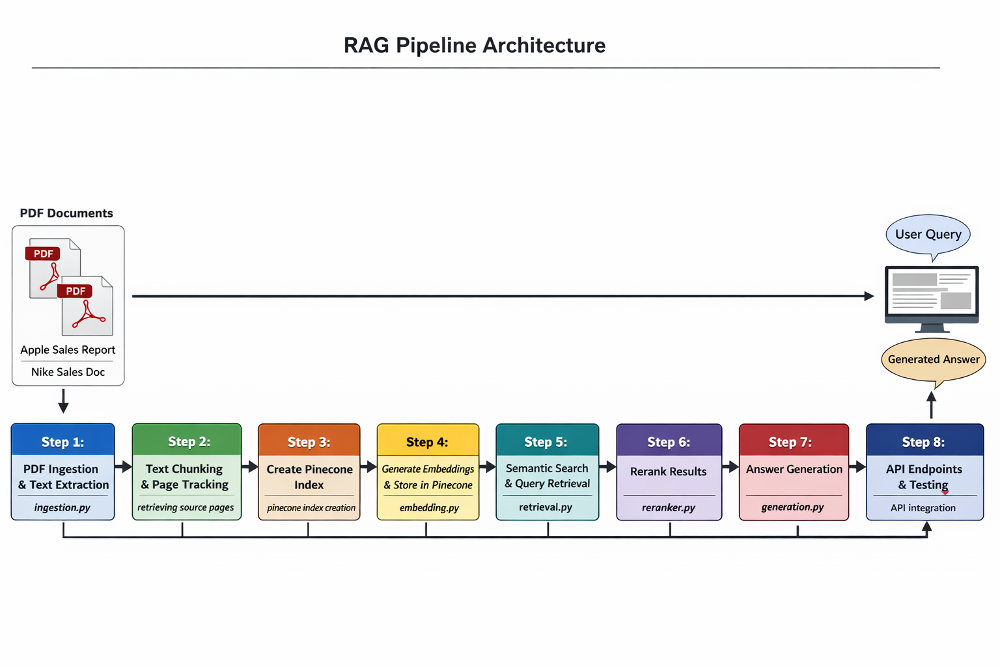
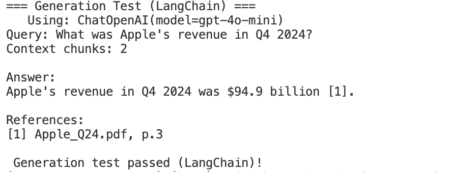

 RAG Classic Pipeline Architecture - 
--------------------------------------
A modular, production-style implementation of a Retrieval-Augmented Generation (RAG) system built from scratch using clean architecture principles.
This project demonstrates how to design and implement a complete RAG pipeline including:
PDF ingestion
Text chunking with page tracking
Embedding generation
Pinecone vector storage
Semantic search
Reranking
Answer generation
API integration

<p align="center">
  
</p>


--------
System Architecture
-----------------------
The pipeline is divided into clearly separated modules to maintain scalability and maintainability.
-  End-to-End Flow

PDF Ingestion
Text Chunking + Page Tracking
Pinecone Index Creation
Embedding Generation & Storage
Semantic Search
Reranking
Answer Generation
API Endpoint Integration

----------------------
 Project Structure
 ----------------

 ```

RAG_CLASSIC_PIPELINE/
│
├── apps/
│   ├── __init__.py
│   ├── config.py
│   ├── ingestion.py
│   ├── embeddings.py
│   ├── retrieval.py
│   ├── reranker.py
│   └── generation.py
│
├── Apple_Q24.pdf
├── Nike-Inc-2025_10K.pdf
├── main.py
├── pyproject.toml
├── requirements.txt
├── rag_architecture.png
└── README.md

```


 Module Breakdown
 ----------------
1️⃣ ingestion.py

 ```

Loads PDF documents
Extracts raw text
Preserves page-level metadata
```

2️⃣ embeddings.py

```
Converts text chunks into vector embeddings
Prepares vectors for storage in Pinecone
```

3️⃣ retrieval.py

```
Performs semantic search
Retrieves top-k relevant chunks
```

4️⃣ reranker.py

```
Improves retrieval quality
Reorders results based on semantic relevance
```

5️⃣ generation.py

```
Sends retrieved context to LLM
Generates final answer
```

6️⃣ config.py

```
Handles environment variables
Centralizes configuration settings
```

 How to Run
 -----------
1️⃣ Clone Repository

```
git clone https://github.com/PriyankaNeogi/RAG_CLASSIC_PIPELINE.git
cd RAG_CLASSIC_PIPELINE
```

2️⃣ Create Virtual Environment

```
python -m venv .venv
source .venv/bin/activate  # Mac/Linux
```

3️⃣ Install Dependencies

```
pip install -r requirements.txt

```

4️⃣ Add Environment Variables

```
Create .env file:
OPENAI_API_KEY=your_key
PINECONE_API_KEY=your_key
PINECONE_ENV=your_env
```

5️⃣ Run Application

```
python main.py

```

 Key Design Principles
 ----------------------
Modular architecture
Separation of concerns
Clean package structure
Reusable components
Production-ready folder layout

Use Case
--------------
This repository demonstrates document-based question answering using:
Apple quarterly sales report (sample short PDF)
Nike annual 10K report (long financial document)
The pipeline is designed to scale to enterprise-grade document systems.


LLM GENERATED OUTPUT - 
------------------
<p align="center">
  
</p>


 


